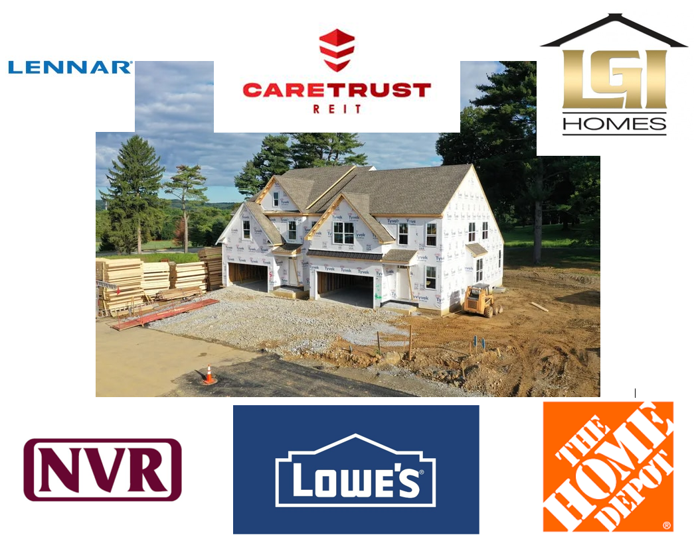

# Housing Home Building Investment

### Description:
#### This a project of long term investment and see which electric cars is a good long term investment. Analyzing technical and fundamental. Analyzing historical data (2 years) and calculate performance measurements, back-testing, forecasting, and using Capital Asset Pricing Model. Testing different trading strategies. Finding stock with lowest risks with highest returns. 

### Stock Tickers:  
CareTrust REIT, Inc. (CTRE)   
The Home Depot, Inc. (HD)   
Lennar Corporation (LEN)   
LGI Homes, Inc. (LGIH)   
Lowe's Companies, Inc. (LOW)  
NVR, Inc. (NVR)  

#### Use accountant statements and historical price in Excel, python, Power BI, and Tableau for Stocks Analysis

### Financial Ratio or Accounting Ratio:  

Profitability Ratio - financial metrics to evaluate the ability of a company to generate income (profit) relative to revenue, balance sheet assets, operating costs, and shareholders’ equity during a specific period of time. It shows how well a company utilizes its assets to produce profit and value to shareholders.  

Operating Ratio – financial metrics to evaluate how well a company is using their assets.  

Leverage Ratios – financial metrics to evaluate how much of an organization's capital comes from debt and it shows a solid indication of whether a business can make good on its financial obligations.  

Valuation Ratios – financial metrics to evaluate how the relationship between the market value of a company or its equity and some fundamental financial metric (e.g., earnings).  

Liquidity Ratios – financial metrics to evaluate how the company's ability to pay debt obligations and its margin of safety through the calculation of metrics including the current ratio, quick ratio, and operating cash flow ratio.   

### CareTrust REIT, Inc (CTRE)    
#### Income Statement  
•	Over the last 5 years, CareTrust REIT, Inc seems to have been stable and increasing profit over the years. This could be due to the acquisition they bought from other companies to have more Senior Apartments/Buildings and Nursing Facilities for tenants. The Acquisition/Investment can be seen in the Cash Flow Statement.  
#### Balance Sheet  
•	Looking at the Liabilities to Asset Ratio, over the last 5 years, CareTrust REIT, Inc, about half of their Liabilities is funding their assets, and the rest is from equity or from shareholders.   
•	Looking at the Liabilities to Equity Ratio, as stated above, CareTrust REIT, Inc relies more on Equity to fund their business and operation.  
#### Cash Flow  
•	Over the past 5 years, CareTrust REIT has acquired a variety of properties to have more housing for seniors and/or nursing facilities. This could also explain why in some years they have a negative cash flow in some years. The expenses they pay such as Dividends and Debt Repayment could also be a factor as well.  

### Home Depot Inc (HD)  
#### Income Statement  
•	Over the past 5 years, Home Depot seems to be in stable condition, and has been seeing a steady gain over the last 5 years.   
#### Balance Sheet  
•	Looking at the Liabilities to Asset Ratio, over the last 5 years, Home Depot is close to and/or exceeding in Liabilities compared to their assets. This could mean that the company is in distress and/or may be unable to pay back its debts. However, it may be highly unlikely that Home Depot may go bankrupt even though they have higher liabilities compared to their assets.   
•	Looking at the Liabilities to Equity, over the last 5 years, Home Depot has too many liabilities compared to their Shareholder’s Equity. Also, there were years that had a negative ratio. The Negative Ratio indicates that liabilities exceed assets.  
#### Cash Flow  
•	Looking at the Net Cash from Acquisitions & Divestitures in 2020, It seems Home Depot made a huge acquisition in December 2020. They have acquired HD Supply. This is one of the reasons why there is a relatively large difference compared to other years in total cash from Investing Activities compared to the years 2017, 2018, 2019, and 2021.  
•	Looking at Net Change in Cash or how much Cash they have leftover. They seem to be gaining or losing over the years. I expect they may make a recovery over the next year to 3 years.   

### Lennar Corp (LEN)    
#### Income Statement  
•	Over the last 5 years, Lennar Corp has gradually had an increase in income. Moreover, it seems that they have acquired some subsidiaries (small companies)/ partnerships due to minority increase (Lennar Corp has stakes in other smaller businesses.) Here is the list of Lennar Corp’s subsidiaries from the SEC: https://www.sec.gov/Archives/edgar/data/920760/000093176303000421/dex21.htm  
#### Balance Sheet    
•	Looking at the Liabilities to Asset Ratio, there seems to be a small decrease in liabilities to asset ratio over the years. The company has been gaining a little bit of time in assets over the years while maintaining a stable liability to asset ratio.   
•	The Liabilities to Equity Ratio, seems to be stable. The minority interest in Equity seems to come from subsidiaries that Lennar Corp has ownership over.   
#### Cash Flow  
• Over the past 5 years of their cash flow, Lennar Corp doesn’t seem to have a stable cash flow. It fluctuates/varies in negative and positive cash flow. However, this could be due to their investment activities due to mergers, acquisitions, and subsidiaries.   

### LGI Homes Inc (LGIH)    
#### Income Statement  
•	Over the past 5 years, LGI Homes Inc, has a gradually had an increase in income over the years. It doesn’t appear they have any subsidiaries because there aren’t any minority interests shown on their income statement. Also, they may have acquired some smaller real estate building companies which will be shown in the Cash Flow Statement.  
#### Balance Sheet   
•	There doesn’t seem to be any long-term liabilities for LGI Homes Inc. It seems all of their liabilities involve current (1 < Less Years).   
•	Their Liabilities to Asset & Liabilities to Equity seem to be stable.  
#### Cash Flow   
• LGI Homes Inc, over the past 5 years, seems to have not had stable cash flow. At year end, they are in negative cash flow in the years 2018-2020 except for 2017 and 2021.   
•	LGI Homes did seem to make some small acquisitions from smaller building companies.   

### Lowes Companies Inc (LOW)  
#### Income Statement  
•	Over the past 5 years, Lowe’s seems to be in stable condition, and has been seeing a steady gain over the last 5 years. However, in 2018, Lowe’s did make a bit less than the previous year in 2017 but was able to recover the following years.  
#### Balance Sheet  
•	Looking at the Liabilities to Asset Ratio, over the last 5 years, Lowe’s uses most of their debt/liabilities to cover the cost of their assets from about 80% to 110%. In the Year 2021, their liabilities exceed their assets. It could be a bad sign that liabilities are close or exceed assets, but it doesn’t always mean a bad thing. It is possible that the sector they are in, and need more debt to fund their assets and operate their business.    
•	Looking at the Liabilities to Equity Ratio – over the past 5 years, Lowe’s Liabilities to Equity gradually increased. Example, in 2017 for every $1 in Shareholder’s Equity owes $5.01. In 2018 $8.47. In 2019 $19.02. In 2020 $31.52. As of 2021, there is a negative ratio because liabilities exceed assets.   
#### Cash Flow  
•	In 2017, Lowe’s only acquired Maintenance Supply Headquarter for around $509M-$512M from their investment activities. There weren’t any future acquisitions and/or divestitures in the following years, 2018-2021.Other than that, Lowe’s seems to have a steady stream of other investment activities.  
•	Lowe’s seems to have a steady stream of dividends paid to shareholders which slowly increased over the years.    
•	The Net Changes in Cash, Lowe’s seem to be losing and gaining money over the years.    

### NVR, Inc (NVR)   
#### Income Statement
•	NVR, Inc. seems to have a positive income statement over the past 5 years. It has increased in Net Income from previous years.   
•	NVR doesn’t seem to have acquired or have any smaller business or own any smaller business because it doesn’t show any minority interest in their income statement.  
#### Balance Sheet  
•	The Liabilities to Asset Ratio seems to be stable. NVR doesn’t seem to be using liabilities much to fund their assets (About close to using half of its liabilities to fund their assets).  
•	The Liabilities to Equity ratio is stable as well. However, their liabilities are almost equivalent to the debt but not a lot. It not at 100% but just about more than 50% reliance on debt.   
#### Cash Flow  
•	NVR, Inc seems to have an increased amount of cash flow over the past 5 years. However, except for 2021. This could be a factor of repurchasing back its own equity or repurchasing back NVR, Inc Shares of stock.  

# Prerequistes
#### Microsoft Azure Machine Learning Studio  

#### Python 3.5+

#### Jupyter Notebook Python 3.5  

#### Excel 2016

#### Power BI  

#### Tableau

## Authors  
### * Tin Hang  

## Disclaimer  
## 🔴 This is not get rich quick.  
## 🔴 This is not financial advisor.   
## 🔴 This is for researching and educational purposes.  
### This is not financial advisor. Do your own research. Do not use this code for investing or trading in the stock market. However, if you are interest in the stock market, you should read books investment, trading, stock market, and finance. Consult a professional investment advisor before making any investment decisions. This educational purposes.  
